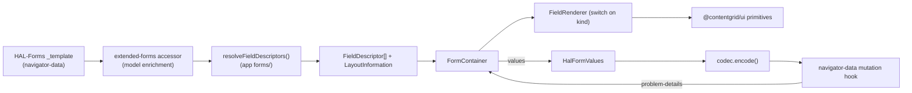

# HAL-Forms Rendering — Analysis & Implementation Plan

**Status:** Design accepted, implementation not started
**Decision of record:** [ADR-004 — HAL-Forms form rendering seam](adr/ADR-004-halforms-form-rendering-seam.md)
**Supporting audit:** [entity-profile-templates-inventory.md](audits/entity-profile-templates-inventory.md) (§9 `FieldDescriptor` mapping)

---

## 1. Purpose

ContentGrid is HAL-Forms–centric. Every mutable operation (create, update,
search, relation set/add/clear) is described by a HAL-Forms `_template`. Some
fields can be enriched with extra semantics aggregated from the entity profile —
this is what the extended-forms accessors in
[`packages/navigator-data/src/accessors/extended-forms`](../packages/navigator-data/src/accessors/extended-forms)
already do (`CreateHalFormTemplate`, `SearchHalFormTemplate`).

We are now implementing **form rendering** on top of that. The goal is a
structured, HAL-first, extensible pipeline that covers four concerns:

1. **Display** the HAL-Forms properties as form fields.
2. **Persist** field values back to the backend.
3. **Let external systems influence field values** (e.g. AI-extracted values,
   automations that pre-fill fields).
4. **Surface both classes of field error**:
   - **External errors** — reported by the backend for a field (RFC 9457
     `problem-details`: validation, uniqueness conflict, relation conflict).
   - **Internal errors** — computed client-side from the field's own HAL-Forms
     constraints (`required`, `regex`, type mismatch).

The value/submit half is already solved by the `@contentgrid/hal-forms` codec:

```ts
import type { HalFormValues } from "@contentgrid/hal-forms/values";

const codec = halFormCodecs.requireCodecFor(template.template);
const request = codec.encode(values); // -> submit via a navigator-data mutation/query hook
```

This document specifies the **rendering half** and the plan to build it.

---

## 2. Architectural placement (per ADR-004)

Form handling splits on the **model-enrichment vs rendering-projection** seam.
The rendering half is **Navigator-specific presentation** and therefore lives in
an app-level module, _not_ in `@contentgrid/navigator-data`.

| Layer                    | Responsibility                                                                                      | Home                                           |
| ------------------------ | --------------------------------------------------------------------------------------------------- | ---------------------------------------------- |
| Raw parse                | `name`, `type`, `options`, `required`, `regex`, `multiValue`, `prompt`, `value`                     | `@contentgrid/hal-forms` (Xenit)               |
| **Model enrichment**     | profile linking, relation cardinality + target hrefs, search-operator parsing, allowed values       | `@contentgrid/navigator-data` (extended-forms) |
| **Rendering projection** | `FieldDescriptor`, `resolveFieldDescriptors`, `LayoutInformation`, `FormContainer`, `FieldRenderer` | **`apps/navigator/src/forms/`** (new)          |
| Dumb widgets             | `input`, `select`, `checkbox`, `button`                                                             | `@contentgrid/ui` primitives                   |

**Consequence for fetching:** because the rendering projection lives in the app
`forms/` module (not in `@contentgrid/ui`), a relation `FieldRenderer` is allowed
to call `@contentgrid/navigator-data` hooks directly to resolve a related item.
The `@contentgrid/ui` primitives stay dumb — they receive already-resolved
display values as props. This keeps `ui → navigator-data` out of the graph while
still letting relation fields fetch.

---

## 3. Data flow



The `forms/` module owns steps C–F. Everything left of C is reusable by any HAL
frontend; everything from C rightward is Navigator's rendering model.

---

## 4. Building blocks

### 4.1 `FieldDescriptor` — a discriminated union

A `FieldDescriptor` is a **presentation projection** of an enriched HAL-Forms
property. The `kind` discriminant tells the renderer _which widget to draw_; it
is derived deterministically from HAL-Forms semantics (`type` + options shape +
`maxItems`) with no layout or user input. Base fields are carried on every
variant; per §9 of the templates-inventory audit the closed set of kinds is:

```ts
interface FieldDescriptorBase {
  readonly name: string; // raw HAL-Forms property name (may include ~suffix for search)
  readonly label: string; // property.prompt ?? humanised(name)
  readonly required: boolean;
  readonly readOnly: boolean;
  readonly description?: string;
  /** Carry the underlying enriched property so renderers never re-parse. */
  readonly property: HalFormsProperty;
}

type FieldDescriptor =
  | ({ kind: "text" } & FieldDescriptorBase & { regex?: RegExp; maxLength?: number })
  | ({ kind: "number" } & FieldDescriptorBase & { min?: number; max?: number; step?: number })
  | ({ kind: "datetime" } & FieldDescriptorBase)
  | ({ kind: "boolean" } & FieldDescriptorBase)
  | ({ kind: "file" } & FieldDescriptorBase)
  | ({ kind: "enum" } & FieldDescriptorBase & { options: readonly string[]; multiValue: boolean })
  | ({ kind: "relation" } & FieldDescriptorBase & {
        cardinality: "to-one" | "to-many";
        targetHref: string; // collection URL from options.link.href
        valueField: string; // e.g. /_links/self/href
      })
  // search-only kinds:
  | ({ kind: "filter" } & FieldDescriptorBase & {
        attributeName: string; // name before ~
        operator: string; // parsed from ~suffix
        options?: readonly string[];
      })
  | ({ kind: "sort" } & FieldDescriptorBase & {
        options: readonly {
          property: string;
          direction: "asc" | "desc";
          value: string;
          prompt?: string;
        }[];
      });
```

The renderer switches over `kind` and is **exhaustiveness-checked** by the
compiler — a new variant is a three-file change (type, renderer case, story),
not a runtime-tester registration.

### 4.2 `resolveFieldDescriptors` — the projection

Pure functions in `apps/navigator/src/forms/`. They consume the enriched
template (or the raw `HalFormsTemplate`) and emit descriptors + layout. They do
**not** fetch and hold no React state.

```ts
function resolveCreateFieldDescriptors(form: CreateHalFormTemplate): FormModel;
function resolveSearchFieldDescriptors(form: SearchHalFormTemplate): FormModel;
function resolveUpdateFieldDescriptors(form: /* item default template */): FormModel;

interface FormModel {
  readonly fields: readonly FieldDescriptor[];
  readonly layout: LayoutInformation;
}
```

> Naming: these supersede the informal `transformHalFormToFieldDescriptors`
> sketch. They align with WI-2 (`resolveFieldDescriptors`) in
> [phase-5d7-workitems.md](audits/phase-5d7-workitems.md).

### 4.3 `LayoutInformation` — a **separate** concern

HAL-Forms carries **no** layout metadata (confirmed by audit §9). Layout
therefore cannot be derived from the template — it comes from convention +
user preferences. Keep it out of `FieldDescriptor`; it only _references_ field
names so the two can evolve independently.

```ts
interface LayoutInformation {
  /** Ordered groups of field names; a group renders as a section. */
  readonly groups: readonly {
    readonly id: string;
    readonly title?: string;
    readonly orientation: "vertical" | "horizontal";
    readonly fieldNames: readonly string[];
  }[];
  /** Fields hidden by user preference (still submitted if they have values). */
  readonly hidden?: readonly string[];
}
```

A default layout (single vertical group, source order, required-first optional)
is produced by the resolver; user preferences override it later without touching
descriptor resolution.

### 4.4 `FormContainer` — controlled, presentation-only

Renders `fields × layout`. It is **controlled**: it owns no server state and
holds `values` via props so external systems can write through the same
`setValue` path (single source of truth).

```ts
interface FormContainerProps {
  fields: readonly FieldDescriptor[];
  layout: LayoutInformation;
  values: HalFormValues<TSpec>;
  setValue: (name: string, value: unknown) => void;
  setValues: (next: HalFormValues<TSpec>) => void;
  /** Per-field slot for extra UI (e.g. an "AI-extracted" tooltip icon). */
  renderFieldFooter?: (field: FieldDescriptor) => React.ReactNode;
  /** Structured backend errors, keyed lookup by field. */
  externalErrors?: (field: FieldDescriptor) => readonly FieldError[];
  onSubmit: () => void;
}
```

### 4.5 `FieldRenderer` — the `kind` switch

```tsx
function FieldRenderer({ field, value, onChange, error, footer, ...dom }: FieldRendererProps) {
  switch (field.kind) {
    case "text":     return <TextField .../>;
    case "number":   return <NumberField .../>;
    case "datetime": return <DateTimeField .../>;
    case "boolean":  return <CheckboxField .../>;
    case "enum":     return <SelectField options={field.options} .../>;
    case "file":     return <FileField .../>;
    case "relation": return <RelationField targetHref={field.targetHref} .../>; // may fetch via navigator-data
    case "filter":   return <FilterField .../>;
    case "sort":     return <SortField options={field.options} .../>;
    default:         return assertNever(field);
  }
}
```

- Standard DOM handlers (`onFocus`, `onBlur`, `onHover`, …) pass through.
- The `relation` renderer resolves a related item/URL value into a display label
  by calling a navigator-data hook (allowed here — see §2), and offers an inline
  "create target" affordance.
- The same switch serves **search** via the `filter`/`sort` kinds. Note the
  value semantics differ (operators/ranges vs entity values), so search reuses
  the **leaf inputs**, not the value model — see §6.

### 4.6 Errors — one structured shape, two sources

```ts
interface FieldError {
  readonly source: "internal" | "external";
  readonly message: string;
  /** For external errors: the RFC 9457 problem type + extras, preserved. */
  readonly problemType?: string;
  readonly detail?: Record<string, unknown>; // e.g. conflicting_item, allowed_values, missing_item
}
```

- **Internal** errors are derived from the descriptor's own constraints
  (`required`, `regex`, type) — ideally via a Zod schema generated _from_
  `FieldDescriptor[]`, so there is one validator generator, not N hand-written
  checks (aligns with the roadmap's "Zod derived from FieldDescriptor").
- **External** errors map from `problem-details`. Do **not** flatten to
  `string[]`: preserve the typed payload so fields can render the rich cases the
  platform defines — `input/validation/duplicate` (`conflicting_item`),
  `allowed-values` (`allowed_values[]`), `missing-relation-target`
  (`missing_item`). See the problem-type catalogue in the root `CLAUDE.md`.

### 4.7 Values & submit

Values live as `HalFormValues<TSpec>` in the container's local/Zustand state
(per ADR-001, form draft state is client state). Submit encodes once and hands
off to a navigator-data hook:

```ts
const codec = halFormCodecs.requireCodecFor(template.template);
const request = codec.encode(values);
mutate(request); // useCreate / useUpdate (If-Match/ETag) / useSearch
```

---

## 5. Worked example — create form

Smart/dumb split:

- **`CreateEntityItemContainer`** (smart) — owns `values`, submits via
  `useCreate`, fires `onCreate`, runs external automations that pre-fill values
  (through `setValue`), and holds per-field extra state (external validation
  errors, "additional info" annotations such as "extracted by AI").
- **`CreateEntityItemForm`** (dumb-ish) — calls
  `resolveCreateFieldDescriptors(createHalFormTemplate)` to get
  `{ fields, layout }`, then renders `FormContainer`. Any future
  userPreferences-driven layout/renderer customisation is detected and enclosed
  at this step.

```tsx
<CreateEntityItemContainer profileEntity={pe} onCreate={goToItem}>
  {/* internally: */}
  <CreateEntityItemForm
    template={createHalFormTemplate}
    values={values}
    setValue={setValue}
    setValues={setValues}
    renderFieldFooter={(f) => annotations[f.name] && <InfoTooltip .../>}
    externalErrors={(f) => backendErrors[f.name] ?? []}
  />
</CreateEntityItemContainer>
```

---

## 6. Search-form reuse

The audit maps `search` templates to `filter` + `sort` kinds, whose values are
**operators/ranges**, not entity attribute values. Reuse strategy:

- **Reuse** the leaf widgets (text/number/datetime/enum inputs) via the same
  `FieldRenderer` switch.
- **Do not** force one value model: `filter` fields group range-pairs
  (`~from`/`~until`) and carry an `operator`; keep that in the search resolver
  and the search container, separate from create/update values.

---

## 7. Implementation plan

Phases are ordered so each builds on the previous and is independently testable.
Ticket references point at existing work items where they already exist.

### Phase A — Foundations (`apps/navigator/src/forms/model/`)

| ID  | Deliverable                                                                  | Done when                                                                                   |
| --- | ---------------------------------------------------------------------------- | ------------------------------------------------------------------------------------------- |
| A1  | `FieldDescriptor` discriminated union (all 9 kinds) — **WI-1**               | Type compiles; `assertNever` exhaustiveness holds; unit type-tests for each kind            |
| A2  | `resolveCreateFieldDescriptors` / `resolveSearchFieldDescriptors` — **WI-2** | Pure, no React/no fetch; snapshot tests over the committed profile dump for all 15 entities |
| A3  | `LayoutInformation` + default layout strategy                                | Resolver returns a valid default layout; layout references only existing field names        |

### Phase B — Rendering (`apps/navigator/src/forms/render/`)

| ID  | Deliverable                                            | Done when                                                                                                                 |
| --- | ------------------------------------------------------ | ------------------------------------------------------------------------------------------------------------------------- |
| B1  | Dumb field primitives in `@contentgrid/ui` (as needed) | `TextField`, `NumberField`, `DateTimeField`, `CheckboxField`, `SelectField`, `FileField` exist as primitives with stories |
| B2  | `FieldRenderer` switch                                 | Every `kind` renders; story per kind; a11y snapshot passes                                                                |
| B3  | `FormContainer` (controlled)                           | Renders `fields × layout`; no server state; controlled `values`/`setValue`                                                |
| B4  | Error surface wiring                                   | `FieldError` displayed per field; internal + external both shown                                                          |

### Phase C — Values, validation & submit (`apps/navigator/src/forms/state/`)

| ID  | Deliverable                                        | Done when                                                                                                                   |
| --- | -------------------------------------------------- | --------------------------------------------------------------------------------------------------------------------------- |
| C1  | Value state model (`HalFormValues`) + `setValue`   | Controlled state; external writes go through `setValue`                                                                     |
| C2  | Internal validation (Zod derived from descriptors) | Required/regex/type errors produced client-side; unit tests per constraint                                                  |
| C3  | External error mapping from `problem-details`      | `input/validation*`, `duplicate`, `allowed-values`, `missing-relation-target` mapped to `FieldError` with payload preserved |
| C4  | Codec encode + submit                              | `codec.encode(values)` round-trips; submit via navigator-data hook                                                          |

### Phase D — Operation integrations (`apps/navigator/src/forms/entity/`)

| ID  | Deliverable                                          | Done when                                                                 |
| --- | ---------------------------------------------------- | ------------------------------------------------------------------------- |
| D1  | `CreateEntityItemContainer` + `CreateEntityItemForm` | Create flow works end-to-end against MSW; `onCreate` fires                |
| D2  | Update flow (ETag / `If-Match`)                      | 412 re-fetch/retry handled; optimistic-concurrency test green             |
| D3  | Search form reuse (`filter`/`sort`)                  | Search UI built from the same renderer; range-pair grouping works         |
| D4  | Round-trip parity tests — **HZN-5A.6**               | `FieldDescriptor` resolution + value round-trip asserted for all entities |

### Phase E — Extensibility hooks

| ID  | Deliverable                                      | Done when                                                                     |
| --- | ------------------------------------------------ | ----------------------------------------------------------------------------- |
| E1  | `renderFieldFooter` slot                         | Per-field custom UI (e.g. AI-extracted tooltip) renders                       |
| E2  | External automations write values via `setValue` | An automation can pre-fill fields; single-source-of-truth preserved           |
| E3  | Relation field fetch + inline-create             | Relation renderer resolves a URL value to a label; "create target" opens flow |

---

## 8. Open questions

- **Extraction to a shared package.** The `forms/` module starts app-level
  (`apps/navigator`). Per ADR-004's "reconsider when", it is extracted to a
  shared package (or `packages/features`) only when `navigator-experimental` or a
  custom app needs it. Track the first cross-track consumer.
- **User-preference layout persistence.** Where do layout overrides live
  (per-user config vs local storage)? Out of scope for Phase A–D; the
  `LayoutInformation` shape is designed to accept them later.
- **Multi-select string enums.** No production example exists (audit §9); the
  `enum` `multiValue: true` path is reserved but untested against real data.

---

## 9. Cross-references

- [ADR-004 — HAL-Forms form rendering seam](adr/ADR-004-halforms-form-rendering-seam.md)
- [ADR-001 — state management (Zustand + TanStack Query)](adr/ADR-001-state-management-zustand-tanstack-query.md)
- [ADR-007 — two-layer dependency model](adr/ADR-007-two-layer-dependency-model.md)
- [Templates inventory audit §9 — `FieldDescriptor` mapping](audits/entity-profile-templates-inventory.md)
- [Phase 5D.7 work items — WI-1 / WI-2 / HZN-5A.6](audits/phase-5d7-workitems.md)
- Model-enrichment accessors: [`packages/navigator-data/src/accessors/extended-forms`](../packages/navigator-data/src/accessors/extended-forms)
